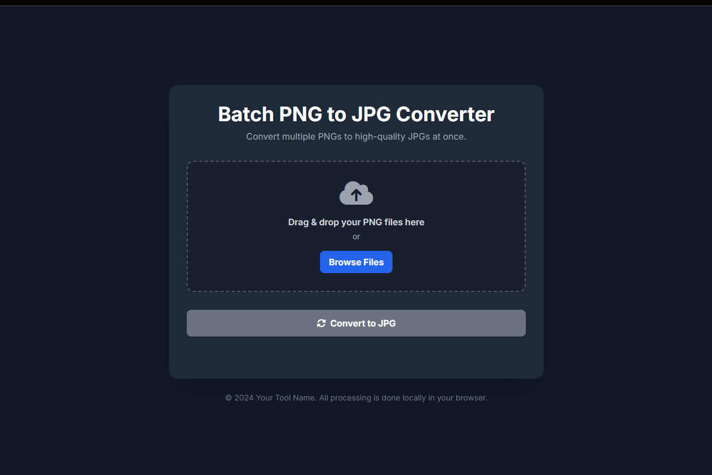

# Batch PNG to JPG Converter

A simple, fast, and privacy-focused web tool for converting multiple PNG images to high-quality JPG files. All processing is done directly in your browser, so your images never leave your computer.
[DEMO](https://batch-png-to-jpg-tool.pages.dev )

## ✨ Features

* **Batch Conversion**: Convert multiple PNG files to JPGs in a single operation.
* **Client-Side Processing**: 100% browser-based. Your files are **never** uploaded to a server, ensuring complete privacy.
* **Drag & Drop Interface**: Easily add files by dragging them onto the window. A standard file browser is also available.
* **High-Quality Output**: Converts images to JPG at maximum quality (100%).
* **Handles Transparency**: Automatically fills the transparent areas of PNGs with a white background.
* **Responsive Design**: Works smoothly on both desktop and mobile browsers.
* **No Installation Needed**: It's a single HTML file. Just open it in your browser to use the tool.

---

## 🚀 How to Use

1.  **Open the Tool**: Open the `png to jpg.html` file in a modern web browser (like Chrome, Firefox, or Edge).
2.  **Add Files**: Drag and drop your PNG files onto the designated area, or click the **"Browse Files"** button to select them from your computer.
3.  **Convert**: Click the **"Convert to JPG"** button. The status of each file will update from "Pending" to "Done" as it's processed.
4.  **Download**: Once all files are converted, click the **"Download All"** button. The converted JPG files will be saved to your default downloads folder.
5.  **Clear**: To start over, click the **"Clear"** button to remove all files from the list.

---

## 🛠️ How It Works

This tool leverages modern web technologies to perform all conversions locally.

When a PNG file is added, it is read by the browser. The JavaScript code then:
1.  Creates an in-memory `<canvas>` element.
2.  Draws a white rectangle on the canvas to serve as the background.
3.  Draws the PNG image on top of the white background. This effectively handles any transparency.
4.  Exports the canvas content as a `image/jpeg` Blob (Binary Large Object) at 100% quality.
5.  When you click download, these Blobs are converted into downloadable files.

---

## 💻 Technologies Used

* **HTML5**: The structure of the web page.
* **JavaScript (ES6+)**: Powers all the client-side logic for file handling, conversion, and downloading.
* **Tailwind CSS**: A utility-first CSS framework for the modern and responsive user interface.
* **Font Awesome**: Used for icons.

---

## 📄 License

This project is licensed under the MIT License.
